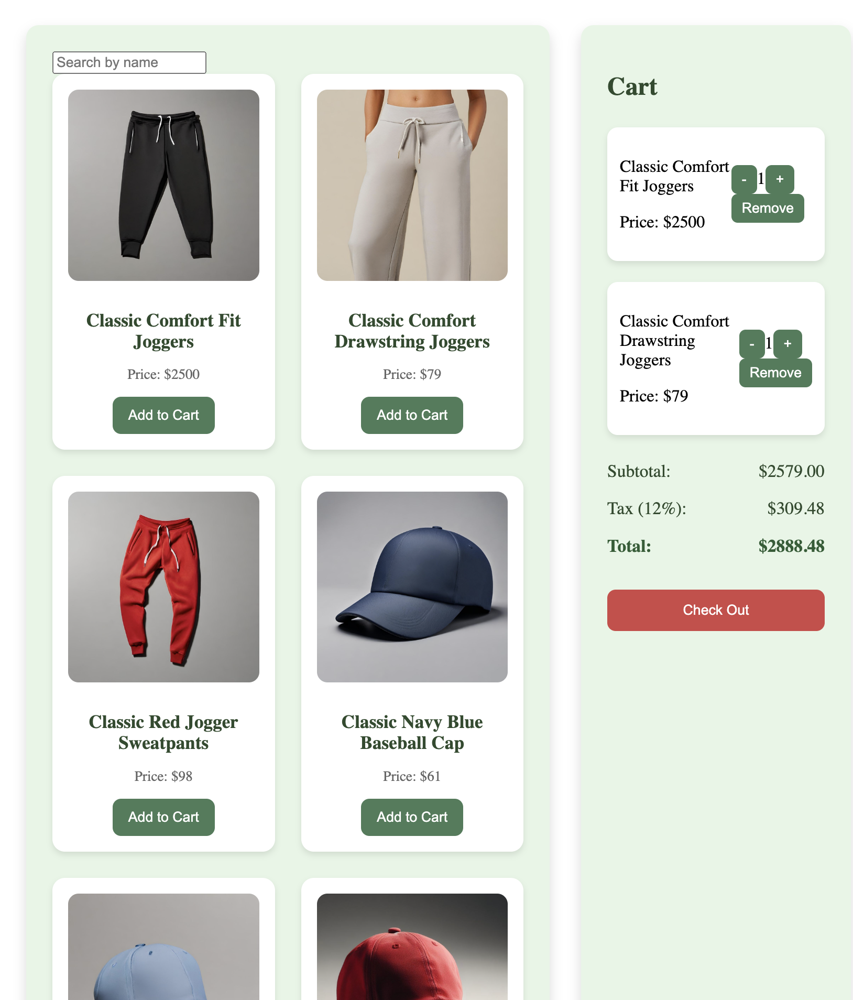

# Shopping Cart 

This is a Shopping Cart Application built with React + Vite that allows users to add to their cart while seeing the accumulated total price of their selections and also allows them to search for products.

## Features

- Add items to the cart
- Update item quantities
- Remove items from the cart
- Checkout and reset the cart

## Getting Started

Follow these instructions to set up and run the project on your local machine.

### Prerequisites

Ensure you have **Node.js** and **npm** installed on your machine. Download them from [Node.js](https://nodejs.org/).

### Installation

1. **Clone the repository**:

   ```bash
   git clone https://github.com/tvclemana/shopping-cart.git

   ```

2. **Navigate to the project directory**:

   ```bash
   cd shopping-cart
   ```

3. **Install dependencies**:

   ```bash
   npm install
   ```

4. **Running the Project**:
   To start the project in development mode, run:

   ```bash
   npm run dev
   ```

   This will start the Vite development server. Open your browser and go to http://localhost:5173 to view the application.

## Libraries and Tools Used

- Vite : Fast Frontend Build Tool
- React : JavaScript Library for building UI
- React ROUTER DOM : Declarative Routing for React applications
|                                                  |

```bash
_Project Structure_
shopping-cart/
├── index.html # Entry HTML file
├── package.json # Project configuration and dependencies
├── vite.config.js # Vite configuration
├── src/
│ ├── App.css # Global CSS for the application
│ ├── App.jsx # Main application component with routes
│ ├── main.jsx # Entry point for the React application
│ ├── components/
│ │ ├── Cart.jsx # Cart component displaying items in the cart
│ │ ├── CartItem.jsx # Component for individual items in the cart
│ │ ├── ProductItem.jsx # Component for individual products
│ │ └── ProductList.jsx # Component for displaying the list of products
│ └── pages/
│ ├── CheckoutPage.jsx # Checkout page with order summary
│ └── HomePage.jsx # Home page displaying products and cart
└── public/
└── assets/ # Any static assets like images or icons
```

# Shopping Cart

A shopping cart application built with React and Vite, using the Platzi Fake Store API to fetch product data.



## API

This project uses the [Platzi Fake Store API](https://fakestoreapi.com/) to retrieve product information, allowing users to browse, add, and manage items in the cart.

## Project Setup

This template provides a minimal setup to get React working in Vite with Hot Module Replacement (HMR) and includes some ESLint rules for code quality.

## Official Plugins Used

This project includes support for two official plugins for React in Vite:

- **[@vitejs/plugin-react](https://github.com/vitejs/vite-plugin-react/blob/main/packages/plugin-react/README.md)**: Uses [Babel](https://babeljs.io/) to enable Fast Refresh in development mode.
- **[@vitejs/plugin-react-swc](https://github.com/vitejs/vite-plugin-react-swc)**: Uses [SWC](https://swc.rs/) for Fast Refresh, offering an alternative to Babel with faster compilation.

